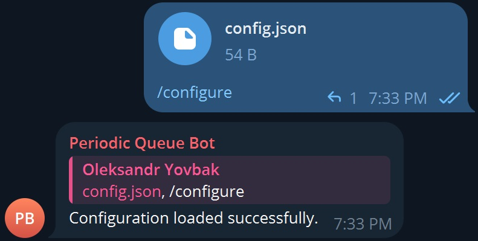

# Periodic Queue Bot
Bot manages creation of queues / attendance lists for periodic events.


## Prerequisites:
You will need `docker` to be installed on your system.
See: https://docs.docker.com/engine/install/

## Configuration:
You can configure the bot by using `/configure` comand and attaching configration file.

Example of a configuration file:
```
{
    "timezone": "Etc/UTC",
    "events": [
        {
            "name": "Math class",
            "description": "Some description",
            "initial_date": "01-10-2024 12:30:00 +0200",
            "periodicity": {
                "weeks": "1"
            },
            "times_occurred": 2,
        },
        {
            "name": "Mandatory Dota 2 session",
            "initial_date": "03-10-2024 16:00:00 +0200",
            "offset": {
                "days": "2 + 3 * (t % 2)"
            }
            "periodicity": {
                "days": "2 + 3 * (n % 2)"
            },
        }
    ]
}
```
Fields:
- `timezone`: Optional field. If timezone is specified, bot will send messages with timezone aware datetimes. Defaults to `Etc/UTC`. You can find the list of available values [here](https://en.wikipedia.org/wiki/List_of_tz_database_time_zones) in column `TZ identifier`.
- `events`: List of events.

Each `events` object has fields:
- `name`: Event name.
- `description`: Optional field. Event description, will be included in notification message.
- `initial_date`: Initial event date in format `%d-%m-%Y %H:%M:%S %z`. It can be in the past, the bot will automatically compute the next date of event occurrence using periodicity rules and update `times_occured` accordingly.
- `periodicity`: Optional field. Contains rules of periodicity, if not specified, event will occur only once on the `initial_date`.
- `offset`: Optional field. Contains rules of notification offset. Offset means how much time before the event occurres, the notification message should be sent. If not specified, notification message will be sent when the event occurres.
- `times_occurred` Optional field. Sets the number of times the event has already occurred.

`periodicity` and `offset` objects have fields:
- `years`: Optional field. Formula to calculate years.
- `months`: Optional field. Formula to calculate months.
- `weeks`: Optional field. Formula to calculate weeks.
- `days`: Optional field. Formula to calculate days.
- `hours`: Optional field. Formula to calculate hours.
- `minutes`: Optional field. Formula to calculate minutes.
- `seconds`: Optional field. Formula to calculate seconds.

## Periodicity
You can create periodic event that happens every day:
```
{
    "name": "Daily event",
    "initial_date": "01-10-2024 12:30:00 +0200",
    "periodicity": {
        "days": "1"
    }
}
```
Every week and one day (if this week the event has occurred on Friday, next week it will occur on Saturday):
```
{
    "name": "Something-ly event",
    "initial_date": "01-10-2024 12:30:00 +0200",
    "periodicity": {
        "weeks": "1",
        "days": "1"
    }
}
```
And so on.

**Values in periodicity fields are not just numbers. They are formulas.**
You can use variables `t` and `n` in them to create more complex rules.

The `t` variable stands for the number of times an event has already occurred.
The `n` variable stands for the ordinal number of an event that the next date is being
calculated for, so `n` always equals `t + 1`.
The `n` variable introduced solely for the purpose of writing clean formulas without the
need of `t + 1` to immitate the value of `n` variable.
You can specify `times_occurred` value when creating an event, then the `t` variable
for the next event calculation will be equal to `times_occurred` and `n` will be
equal to `times_occurred + 1`.

```
{
    "name": "Biweekly event",
    "initial_date": "01-11-2024 12:30:00 +0200",
    "offset": {
        "days": "2 + 3 * (t % 2)",
        "minutes": "10"
    }
    "periodicity": {
        "days": "2 + 3 * (n % 2)"
    }
    "times_occurred": 2,
}
```
This way we can create an event that happens weekly on Thursdays and Fridays,
with notification message for an event wiil be sent 10 minutes before the previous event.
(E.g. notification message for Friday's event will be sent 10 minutes before Thursday's event).
**If periodicity value ends up being irrational it will be rounded using Python's standard `round`
function. Minimum allowed periodicity is one (1) minute.**

## Hosting
Fastest way to host the bot is to host it locally. Even though it's not the best way but it's the easiest.
All you need is `docker` installed on your system.
See: https://docs.docker.com/engine/install/

Quickstart:
1. Clone this repository
    ```
    git clone https://github.com/probablyskela/periodic-queue-bot.git
    ```
2. Create a new bot using [@BotFather](https://telegram.me/BotFather) to get a token.
3. Create `dev.env` file in `deployments/local/env_files` and fill it according to `example.env`. For `TOKEN` use token that you got from BotFather.
4. Run command
    ```
    make rebuild
    ```
    This will build bot image and run all needed containers using docker compose.
5. Create and migrate the database by running the commands:
    ```
    docker compose -f deployments/local/compose.yaml -p pqbot exec postgres sh
    psql -U postgres
    CREATE DATABASE <database-name>;
    \q
    exit
    make migrate
    ```
    `<database-name>` should be equal to the value of `POSTGRES__PATH` in your `dev.env` file.
6. Use the bot
